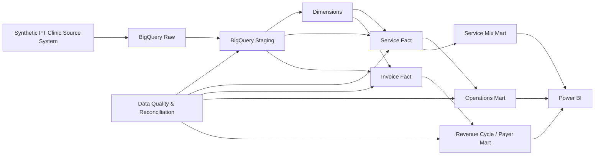

# Architecture

## Modeling decision: two facts
The academic design used `ClinicService` as the central service-grain fact. During portfolio implementation, the financial design was hardened by separating invoice-level measures into `fact_invoice`. This prevents invoice totals and payments from being duplicated when a single appointment contains multiple services.

This is a deliberate dimensional-modeling improvement and an important interview talking point: **facts must be modeled at a grain compatible with their measures**.

## BigQuery design choices
- Partition service activity by `appointment_date`.
- Partition invoice activity by `invoice_date`.
- Cluster service fact by therapist/service/payer keys.
- Cluster invoice fact by payer/patient keys.
- Keep raw/staging/core/marts separated to make lineage and responsibilities explicit.
- Expose denormalized business marts for self-service BI while retaining governed facts/dimensions underneath.
